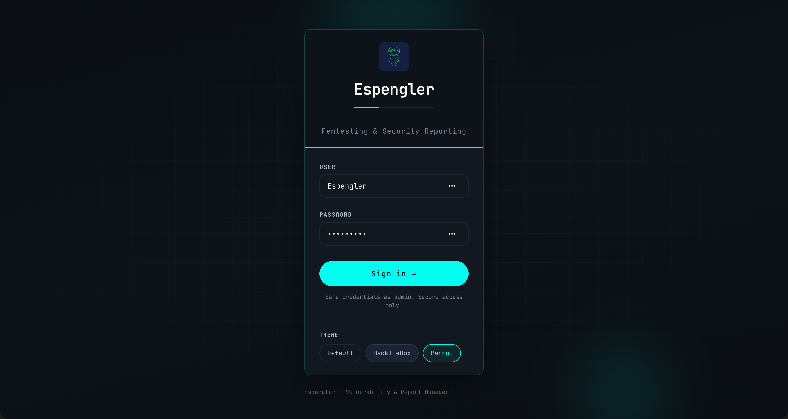
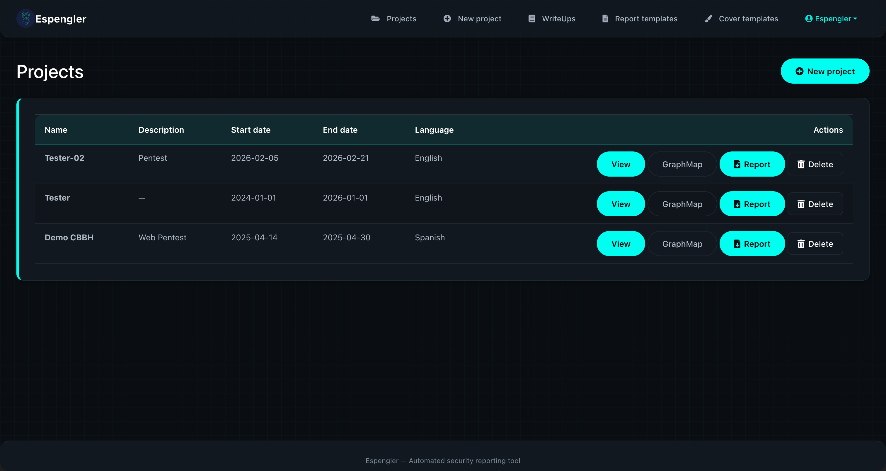
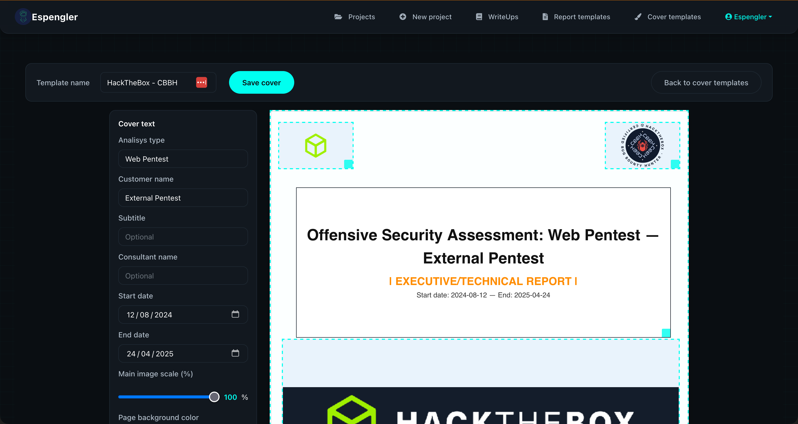
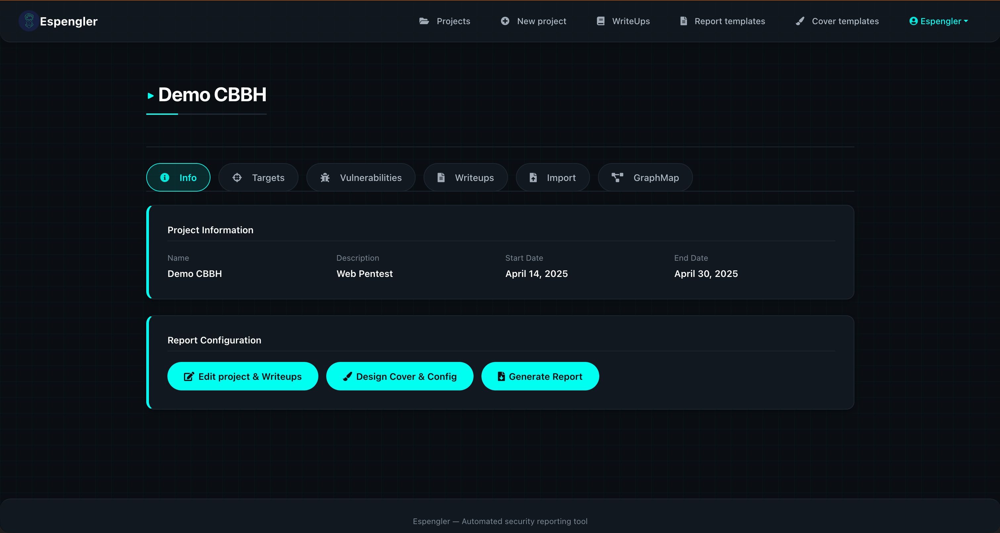
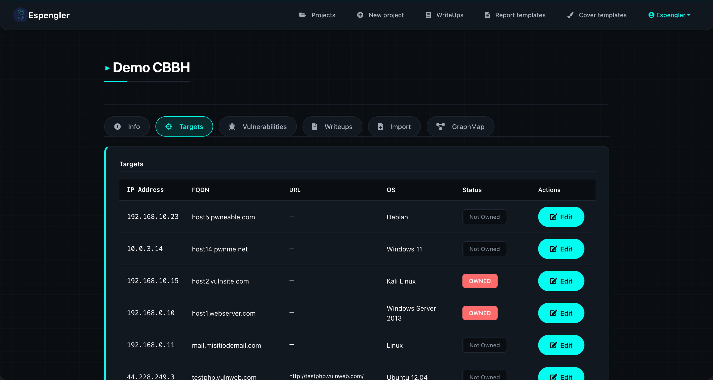
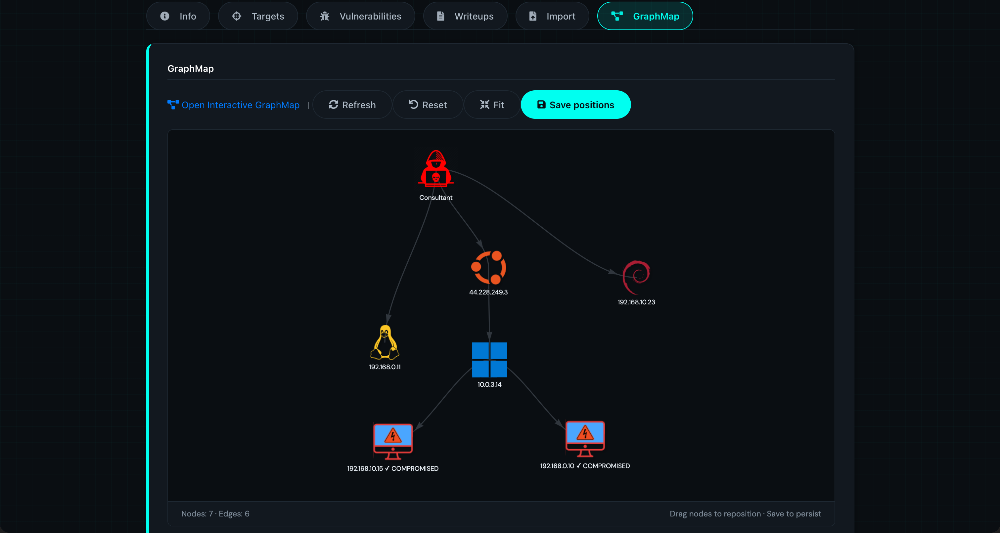
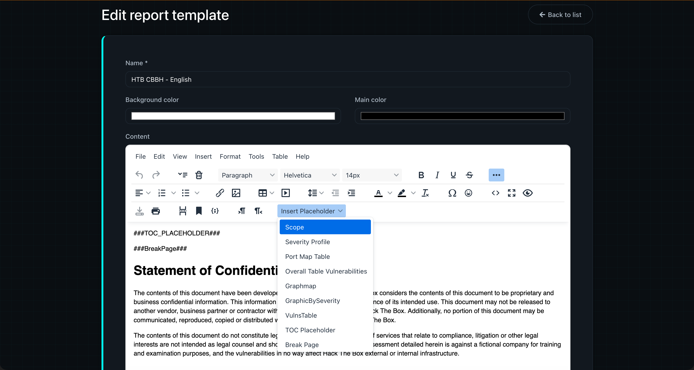
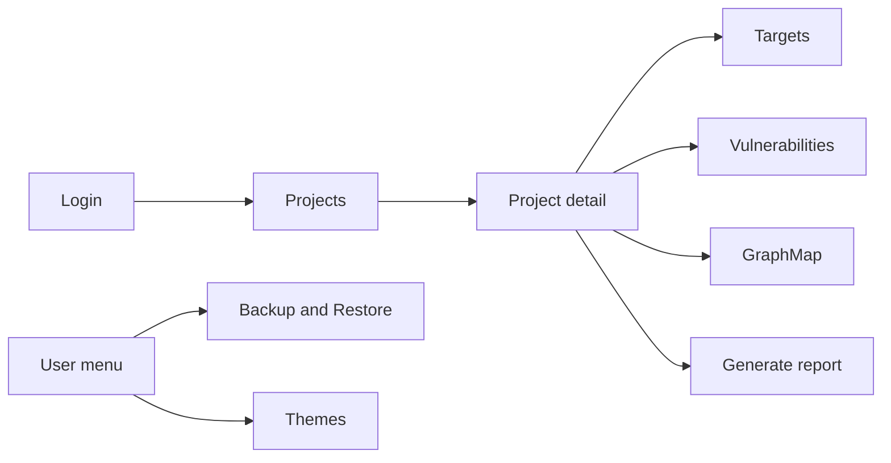
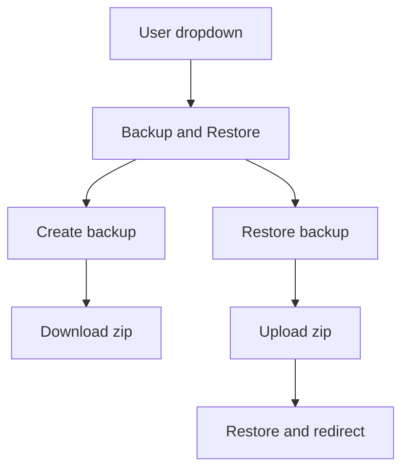

# Espengler


Espengler is a professional tool for **automated offensive security and pentest reporting**. It helps you manage audit projects, document vulnerabilities, attach evidence, visualize attack paths, and export customized reports in Spanish or English.

---

# Screenshots















---

## Features

### Project and target management

- Create and edit projects with name, description, dates, scope, and report/cover templates.
- Define targets (hosts) per project with IP, hostname, OS, and “owned” status.
- Manage project members and visibility (admin vs consultant roles).

### Vulnerability documentation

- Record findings with title, description, severity, solution, references, and CVSS.
- Attach evidence images and link writeups to vulnerabilities.
- Import scan results from Nessus, Nmap, Netsparker, Acunetix, and Burp Suite (XML).

### Report generation

- Export professional `.docx` reports with project info, scope, vulnerabilities, evidence, and graphs.
- Placeholders: TOC, scope, severity profile, port map table, vulnerability tables, GraphMap image, and page breaks.
- Choose report language (Spanish or English) per project.
- Cover designer: visual editor for report cover (layout, background, logo, title, subtitle).

### Attack narrative and writeups

- Writeups with TinyMCE rich editor (images, formatting, placeholders).
- Import writeups from Obsidian (Markdown).
- Associate attack narratives with projects.

### GraphMap (attack graph)

- Interactive attack graph showing targets and compromise paths.
- Embedded in project detail (iframe) and openable in a new tab.
- Themed for default, HackTheBox, and Parrot; respects app theme.
- Optional PNG export via `scripts/generate_graphmap_pngs.py` (Node.js required for that script).

### Backup and restore

- **Custom UI** (no Django admin): open **Backup & Restore** from the user menu (top-right dropdown).
- **Create backup:** download a `.zip` of projects and related data.
- **Restore:** upload a `.zip` backup to restore projects and data.

### Theming

- **Default** theme with light/dark toggle.
- **HackTheBox** and **Parrot** themes (dark, distinct accent colors).
- Theme selector in the user dropdown; choice persisted in `localStorage`.

### Roles

- **Admin:** access to all projects and settings.
- **Consultant:** access only to projects to which they are assigned (project members).

---

## Tech stack

- **Backend:** Python 3.11, Django 5.x
- **Editor:** TinyMCE (Tiny Cloud or self-hosted)
- **Reports:** python-docx, html2docx
- **Optional:** Node.js for GraphMap PNG generation script

---

## Installation

### Local setup

1. Clone the repository and go to the project root (directory that contains `VulnerabilityManager/`, `requirements.txt`, etc.):

   ```bash
   git clone https://github.com/pereznacho/Espengler.git
   cd Espengler/scripts
   ./install-linux.sh
   ```

2. Create and activate a virtual environment:

   ```bash
   python -m venv venv
   source venv/bin/activate   # Windows: venv\Scripts\activate
   ```

3. Install dependencies and run migrations:

   ```bash
   pip install -r requirements.txt
   cd VulnerabilityManager
   python manage.py migrate
   python manage.py createsuperuser
   python manage.py runserver
   ```

4. Open [http://127.0.0.1:8000/](http://127.0.0.1:8000/) in your browser.

**Optional:** Get a free [Tiny Cloud](https://www.tiny.cloud) API key and set `TINYMCE_JS_URL` in `VulnerabilityManager/settings.py` to the TinyMCE script URL including your key.

**Optional (GraphMap PNGs):** Node.js is only required if you use `scripts/generate_graphmap_pngs.py` to export GraphMap as PNG images.

### Installation on Linux (without Docker)

On Debian-based distributions (Parrot OS, Kali, Ubuntu, Debian), you can install Espengler with a single script and get desktop shortcuts to start and stop the app.

#### Requirements and where to run

- Run the installer from the **project root** (the directory that contains `manage.py` and `requirements.txt`), or from the `scripts/` directory.
- The project **must not be inside the Trash**. If it is, the installer will exit with an error; move or copy the project to a permanent location (e.g. `~/Desktop` or `~/Projects`) first.
- Do **not** run the script as root; it configures a user-level systemd service and desktop shortcuts for your user.
- You will be prompted for `sudo` to install system packages.

#### What the installer does

1. **System dependencies** — Installs Python 3, `python3-venv`, `python3-pip`, and libraries needed for reports (libjpeg, zlib, libpng, cairo, pango, gdk-pixbuf, libffi). If `apt-get update` fails (e.g. due to third-party repo signatures like Microsoft Code), it continues with existing package lists.
2. **Virtual environment** — Creates a venv in the project and installs all Python dependencies there (PEP 668 / “externally-managed-environment” safe; no system-wide pip install). If an existing venv is broken or from another path (e.g. after moving the project), it is recreated.
3. **Migrations** — Runs `migrate`, then `makemigrations` (for any model changes, e.g. ProjectManager), then `migrate` again.
4. **Static files** — Runs `collectstatic --noinput`.
5. **Systemd user service** — Installs `espengler.service` under `~/.config/systemd/user/` so you can start/stop via `systemctl --user`.
6. **Launcher and stop scripts** — Installs `espengler-launcher.sh` and `espengler-stop.sh` in the project’s `scripts/` folder with the project path baked in. The launcher starts the server (systemd if available, otherwise in the background) and opens the browser; the stop script stops either.
7. **Desktop shortcuts** — Adds **Espengler - Start** and **Espengler - Stop** under `~/.local/share/applications/` so they appear in your application menu.

#### Steps

1. Clone the repository and run the installer from the project root:

   ```bash
   git clone https://github.com/pereznacho/Espengler.git
   cd Espengler
   chmod +x scripts/install-linux.sh
   ./scripts/install-linux.sh
   ```

2. Optional flags (use `-h` or `--help` to list them):

   | Flag | Description |
   |------|-------------|
   | `--with-chromium` | Install Chromium for report generation (e.g. GraphMap capture). |
   | `--with-node` | Install Node.js for the GraphMap PNG export script. |
   | `--create-superuser` | Run `createsuperuser` interactively at the end of the install. |

   Example with Chromium and superuser:

   ```bash
   ./scripts/install-linux.sh --with-chromium --create-superuser
   ```

3. After installation:

   - **Start Espengler:** open your application menu and run **Espengler - Start**. The server starts (via systemd if available, otherwise in the background), and the browser opens at [http://127.0.0.1:8000/](http://127.0.0.1:8000/).
   - **Stop Espengler:** run **Espengler - Stop** from the menu. This stops the systemd user service if it was used, or the background process started by the launcher.

4. To create an admin user later (if you did not use `--create-superuser`):

   ```bash
   cd /path/to/Espengler   # use the path where you installed (e.g. ~/Desktop/Espengler)
   source venv/bin/activate
   python manage.py createsuperuser
   ```

#### Troubleshooting (Kali / Debian)

- **Repo signature warnings:** If you see OpenPGP or “Signing key … is not bound” errors for a repo (e.g. `packages.microsoft.com`), the installer continues with the rest; Espengler does not require that repo.
- **Launcher does nothing or fails:** Run the launcher from a terminal to see errors: `./scripts/espengler-launcher.sh`. If the server was started in the background (fallback), logs are in `.espengler.log` in the project root.
- **Script was empty after install:** The installer writes launcher/stop scripts via a temporary file so that installing “in place” (in the same project) does not truncate the source file. If you still see an empty script, restore it from the repo and run the installer again.

### Docker

1. Build the image:

   ```bash
   docker build -t espengler .
   ```

2. Run the container:

   ```bash
   docker run -d -p 8000:8000 --name espengler_container espengler
   ```

3. Open [http://localhost:8000/](http://localhost:8000/) in your browser.

The container creates a default superuser: **username** `Espengler`, **password** `Demo2025$`. Change it after first login.

If you see a migration error (e.g. missing column), run migrations inside the container:

- **Docker Compose:** `docker compose exec espengler_web python manage.py migrate`
- **Docker run:** `docker exec -it espengler_container python manage.py migrate`

---

## Usage

1. **Start the server** (from `VulnerabilityManager/`): `python manage.py runserver`
2. **Log in** at [http://127.0.0.1:8000/login/](http://127.0.0.1:8000/login/)
3. **Create a project:** Projects → New project → set name, dates, language, report and cover templates.
4. **Add targets:** Open the project → add targets (IP, hostname, OS, owned).
5. **Add vulnerabilities:** In the project, add vulnerabilities and evidence images; link writeups if needed.
6. **Import scans (optional):** Use the import forms (Nessus, Nmap, Netsparker, Acunetix, Burp) in the project detail.
7. **View GraphMap:** Open the GraphMap link or the embedded iframe in the project detail.
8. **Configure report cover:** Use “Configure report cover” to open the cover designer.
9. **Generate report:** Use “Generate report” and choose language; download the `.docx`.
10. **Backup / restore:** User menu (top-right) → Backup & Restore → create backup (download `.zip`) or restore (upload `.zip`).

---

## Workflows

### Application flow



### Backup and restore



### Theming

- Open the **user menu** (top-right) → **Themes**.
- Choose **Default** (with light/dark toggle), **HackTheBox**, or **Parrot**.
- The selected theme is stored in the browser and applied on next load.

---

## Project structure

| Path | Description |
|------|-------------|
| `VulnerabilityManager/` | Django project settings, root URLs, WSGI/ASGI. |
| `ProjectManager/` | Projects, targets, vulnerabilities, report/cover templates, GraphMap view, auth (login/logout), profile, project members. |
| `BackupRestore/` | Backup (export) and restore (import) views and logic. |
| `attack_narrative/` | Writeups, attack narratives, Obsidian import. |
| `static/` | CSS (e.g. `app.css`, `themes/parrot.css`, `themes/hackthebox.css`), images (e.g. GraphMap icons), JS. |
| `ProjectManager/templates/` | Base layout, project list/detail, GraphMap, cover designer, report/cover templates, auth pages. |
| `BackupRestore/templates/` | Custom Backup & Restore page (non-admin). |
| `attack_narrative/templates/` | Writeup list/form, import attack narrative, admin overrides. |
| `scripts/` | `capture_graph.js` (GraphMap), `download_graphmap_logos.py`, `generate_graphmap_pngs.py`, `migrate.sh`. |
| `static/images/graphmap/` | Logos oficiales en SVG (nunca PNG) para el GraphMap. Ver `static/images/graphmap/README.md`. |

### GraphMap Logos

- **Windows** (XP, Vista, 7, 8, 10, 11, 12, Server): Official SVG Logos.
- **Linux, Ubuntu, Debian, Kali, Arch, Fedora, Red Hat, macOS, Android**: Official SVG Logos.

To download the SVG logos:

```bash
python3 scripts/download_graphmap_logos.py
```

Detail: `static/images/graphmap/README.md`.

---

## Requirements

- Python 3.11+
- Django 5.x and dependencies in `requirements.txt`
- Tiny Cloud API key (optional but recommended for TinyMCE)
- Node.js only if you use the GraphMap PNG export script

---
## Video
[](https://www.youtube.com/watch?v=tFnlTC5tt5s)


## Contributing

Contributions are welcome. Fork the repository, create a branch for your changes, and open a pull request describing the modifications.

---

## License

Espengler is distributed under the MIT License.
